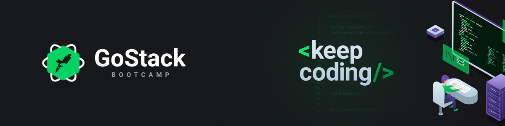

<div align="center">
  

  ## Desafio 04: Conceitos do ReactJS
</div>

## 🔖 Sobre

Aplicação feita durante o defaio 03 do bootcamp da Rocketseat para fixar conceitos do NodeJS. API possibilita o cadatro, atualização, listagem e deleta repositórios além disso é possível dá like nos repositórios.

## 📁 Repósitorios relacionados
- [Frontend](https://github.com/netohelvecio/desafio-conceitos-reactjs)
- Mobile - Ainda em construção.

## 💻: Tecnologias utilizadas

- cors
- express
- nodemon
- uuidv4

## 📂 Como baixar o projeto

```bash
  # Clonar repositório
  $ git clone https://github.com/netohelvecio/desafio-conceitos-nodejs

  # Entrar na pasta do repositório
  $ cd desafio-conceitos-nodejs

  # Instalar dependências
  $ yarn

  # Inicar projeto
  $ yarn dev

  # Arquivo do insomnia está no repositório para testar as rotas.

  # Rodar testes
  $ yarn test
```

---

Desenvolvido por Helvécio Neto
